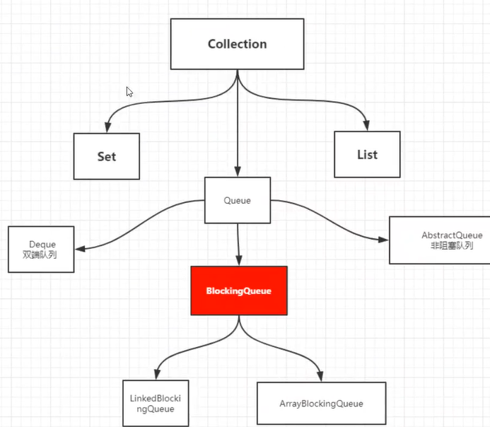

[toc]

## 2、进程与线程  

一个进程往往可以包含多个线程，至少包含一个
java默认有几个线程？2个main、GC

### 开启线程方式  
Thread Runnable Callable
### Java真的可以开启线程吗？  
本地 native方法开启线程、底层的C++ Java无法直接操作硬件
### 并发编程：并发、并行

并发（多线程操作同一个资源）
    CPU一核，模拟出来多条线程，天下武功，唯快不破，快速交替

并行（多个人一起走）
    CPU多核，多个线程可以同时执行：线程池
   ```
    public static void main(String[] args){
            //获取CPU的核数
            //CUP密集型、IO密集型
            System.out.println(Runtime.getRuntime().availableProcessors());
    }
   ```

并发编程的本质:充分利用CPU的资源
   >线程有几个状态

   ```
public enum State {
             //新生
             NEW,
             //运行
             RUNNABLE,
             //阻塞
             BLOCKED,
             //等待
             WAITING,
             //超时等待
             TIMED_WAITING,
             //终止
             TERMINATED;
         }
   ```

   >wait/sleep  

   1、来自不同的类
   wait=>Object
   sleep=>Thread
   2、wait 会释放锁、sleep睡觉了，抱着锁睡觉，不会释放锁
   3、使用范围不同
   wait 必须在同步代码块中
   sleep 可以在任何地方睡


## 3、LOCK锁（重点）

> 传统Synchronized  


公平锁：先来后到

非公平锁：可以插队（默认）


> Synchronized 和 Lock区别

1、Synchronized 内置的java关键字，Lock是java类

2、Synchronized无法判断获取锁的状态，Lock可以判断是否获取到了锁

3、Synchronized会自动释放锁，Lock必须要手动释放锁，如果不释放锁，**死锁**

4、Synchronized 线程1（获得锁，阻塞）、线程2（等待、傻傻的等）；Lock不会一直等下去

5、Synchronized 可重入锁，不可以中断的，非公平；Lock 可重入锁，不可以中断的，非公平(可以自己设置）

6、Synchronized 适合锁少量的代码同步问题；Lock适合锁大量的同步代码

> 锁是什么，如何判断锁的是谁

## 4、生产者和消费者问题

面试的：单例模式、排序算法、生产者消费者、死锁

Synchronized  版

```
class Data {
    private int number = 0;

    //+1
    public synchronized void increament() throws InterruptedException {
        if (number != 0) { //0
            this.wait();
        }
        number++;
        System.out.println(Thread.currentThread().getName() + "=>" + number);
        //通知其他线程，我+1完毕了
        this.notifyAll();
    }

    public synchronized void decreament() throws InterruptedException {
        if (number == 0) { //1
            this.wait();
        }
        number--;
        System.out.println(Thread.currentThread().getName() + "=>" + number);
        //通知其他线程，我-1完毕了
        this.notifyAll();
    }
}
```

> 存在问题，A B C D 4个线程


if改成while

> JUC版  Lock


```
class Data {
    private int number = 0;
    Lock lock=new ReentrantLock();
    Condition condition=lock.newCondition();

    //+1
    public  void increament() throws InterruptedException {
        //选中ctrl+alt+t
        lock.lock();
        try {
            while (number != 0) { //0
                condition.await();
            }
            number++;
            System.out.println(Thread.currentThread().getName() + "=>" + number);
            //通知其他线程，我+1完毕了
            condition.signalAll();
        }catch (Exception e){
            e.printStackTrace();
        }finally {
            lock.unlock();
        }
    }

    public void decreament() throws InterruptedException {
        lock.lock();
        try {
            while (number == 0) { //1
                condition.await();
            }
            number--;
            System.out.println(Thread.currentThread().getName() + "=>" + number);
            //通知其他线程，我-1完毕了
            condition.signalAll();
        } catch (Exception e) {
            e.printStackTrace();
        } finally {
            lock.unlock();
        }

    }
```

**任何一个新的技术，绝对不仅仅只是覆盖原有的技术，优势和补充**

> Condition 精准的通知和唤醒线程

```
class Data3 {
    Lock lock = new ReentrantLock();
    Condition condition1 = lock.newCondition();
    Condition condition2 = lock.newCondition();
    Condition condition3 = lock.newCondition();
    private int number = 1;//1A 2B 3C

    public void printA() {
        try {
            lock.lock();
            //业务， 判断->执行->通知
            while (number != 1) {
                //等待
                condition1.await();
            }
            System.out.println(Thread.currentThread().getName() + "AAAAA");
            //唤醒，唤醒指定的人，B
            number = 2;
            condition2.signal();
        } catch (Exception e) {
            e.printStackTrace();
        } finally {
            lock.unlock();
        }
    }
    public void printB() {
        try {
            lock.lock();
            //业务， 判断->执行->通知
            while (number != 2) {
                //等待
                condition2.await();
            }
            System.out.println(Thread.currentThread().getName() + "BBBBB");
            //唤醒，唤醒指定的人，C
            number = 3;
            condition3.signal();
        } catch (Exception e) {
            e.printStackTrace();
        } finally {
            lock.unlock();
        }
    }
    public void printC() {
        try {
            lock.lock();
            //业务， 判断->执行->通知
            while (number != 3) {
                //等待
                condition3.await();
            }
            System.out.println(Thread.currentThread().getName() + "CCCCC");
            //唤醒，唤醒指定的人，A
            number = 1;
            condition1.signal();
        } catch (Exception e) {
            e.printStackTrace();
        } finally {
            lock.unlock();
        }
    }
}
```

## 5、8锁现象

```
// synchronized 锁的对象是方法的调用者,锁对象
public synchronized void sendSms(){
    System.out.println("sendSms");
}
```

```
//synchronized 锁的对象是Class
public static synchronized void call(){
    System.out.println("call");
}
```

```
//没有锁，不受锁的影响
public void hello(){
    System.out.println("hello");
}
```

## 6、集合类不安全

List

```
/**
 * 并发下ArrayList不安全 Synchronized
 * 1、List<String> list=new Vector<>();
 * 2、List<String> list= Collections.synchronizedList(new ArrayList<>())
 * 3、List<String> list=new CopyOnWriteArrayList<>();
 */
//写入时复制  COW
//多个线程调用的时候，list,读取的时候，固定的，写入（覆盖）
//再写入的时候避免覆盖，造成数据问题
//读写分离
//CopyOnWriteArrayList 比 Vector(Synchronized) 
```

Set

```
/**
 * Set<String> set=new HashSet<>();
 * 1、Set<String> set= Collections.synchronizedList(new HashSet<>())
 * 2、Set<String> set=new CopyOnWriteArraySet<>();
 */
```

hashSet 底层是什么？

```
public HashSet() {
    map = new HashMap<>();
}
```

//add set 本质就是map key是无法重复的

```
public boolean add(E e) {
    return map.put(e, PRESENT)==null;
}
```

```
private static final Object PRESENT = new Object();
```

Map

```
/**
 *Map<String,String> map=new HashMap<String, String>(16,0.75F);
 *1、Collections.synchronizedMap(new HashMap<>());
 *2、Map<String,String> map=new ConcurrentHashMap<>();
 */
```


## 7 Callable 


1、可以返回值

2、可以抛出异常

3、方法不同，run()/ call()

```
public class CallableTest {
    public static void main(String[] args) {
        MyCallable callable=new MyCallable();
        FutureTask task=new FutureTask(callable);//适配器
        new Thread(task,"A").start();
        new Thread(task,"B").start();//结果会被缓存，效率高

        try {
            String o= (String) task.get();//阻塞方法
        } catch (InterruptedException e) {
            e.printStackTrace();
        } catch (ExecutionException e) {
            e.printStackTrace();
        }
    }
}

class MyCallable implements Callable<String>{
    @Override
    public String call() throws Exception {
    System.out.println("call");//只会打印一次
    //耗时的操作
        return "1234";
    }
}
```

**细节**

1、有缓存

2、结果可能需要等待，会阻塞


## 8、常用的辅助类

### 8.1 CountDownLatch  


```
public static void main(String[] args) throws InterruptedException {
    CountDownLatch countDownLatch = new CountDownLatch(6);
    for (int i = 0; i < 6; i++) {
        new Thread(() -> {
            System.out.println(Thread.currentThread().getName() + "Go Out");
            countDownLatch.countDown();//数量-1
        },String.valueOf(i)).start();
    }
    countDownLatch.await();//等待计数器归零，然后再向下执行

    System.out.println("close Door");
}
```

### 8.2 CyclicBarrier  


```
public static void main(String[] args) {
    CyclicBarrier cyclicBarrier = new CyclicBarrier(7, new Runnable() {
        @Override
        public void run() {
            System.out.println("召唤神龙成功！");
        }
    });
    for (int i = 0; i < 7; i++) {
        final int finalI = i;//作用域问题
        new Thread(() -> {
            System.out.println(Thread.currentThread().getName() + "收集" + finalI + "个龙珠");
            try {
                cyclicBarrier.await();
            } catch (InterruptedException e) {
                e.printStackTrace();
            } catch (BrokenBarrierException e) {
                e.printStackTrace();
            }
        }).start();
    }
}
```


### 8.3 Semaphore 

```
public static void main(String[] args) {
    //线程数量：停车位 限流
    Semaphore semaphore = new Semaphore(3);
    for (int i = 1; i <= 6; i++) {
        new Thread(() -> {
            try {
                semaphore.acquire();//得到
                System.out.println(Thread.currentThread().getName() + "抢到车位");
                TimeUnit.SECONDS.sleep(2);
                System.out.println(Thread.currentThread().getName() + "离开车位");
            } catch (InterruptedException e) {
                e.printStackTrace();
            } finally {
                semaphore.release();//释放
            }

        }, String.valueOf(i)).start();
    }
}
```

原理：

`semaphore.acquire()` 获得，假设已经满了，等待，等待被释放为止

`semaphore.release()`释放，会将当前的信号量释放+1，然后唤醒等待的线程

作用：

1、多个共享资源互斥

2、并发限流，控制最大的线程数

## 9、读写锁

`ReadWriteLock`


```

/**
 * 独占锁（写锁）一次只能被一个线程占有
 * 共享锁（读锁）多个线程可以同时占有
 */
public class ReadWriteLockDemo {
    public static void main(String[] args) {
        MyCache myCache=new MyCache();
        for (int i = 0; i < 5; i++) {
            int finalI = i;
            new Thread(()->{
                myCache.put(finalI +"", finalI +"");
            },String.valueOf(i)).start();
        }

        for (int i = 0; i < 5; i++) {
            int finalI = i;
            new Thread(()->{
                myCache.get(finalI +"");
            },String.valueOf(i)).start();

        }


    }
}

class MyCache{
    private volatile Map<String,Object> map=new HashMap<>();
    //读写锁：更加细粒度的控制
    private ReadWriteLock lock=new ReentrantReadWriteLock();
    //存，写入的时候，只希望同时只有一个线程写
    public void put(String key,Object value){
        lock.writeLock().lock();
        try {
            System.out.println(Thread.currentThread().getName()+"写入"+key);
            map.put(key,value);
            System.out.println(Thread.currentThread().getName()+"写入OK"+key);
        } catch (Exception e) {
            e.printStackTrace();
        } finally {
            lock.writeLock().unlock();
        }

    }

    public void get(String key){
        lock.readLock().lock();
        try {
            System.out.println(Thread.currentThread().getName()+"读取"+key);
            Object o=map.get(key);
            System.out.println(Thread.currentThread().getName()+"读取OK"+key);
        } catch (Exception e) {
            e.printStackTrace();
        } finally {
            lock.readLock().unlock();
        }
    }

}
```

## 10、阻塞队列



阻塞

队列

> BlockingQueue


什么情况下我们会使用阻塞队列：多线程并发处理，线程池

**学会使用队列**

添加移除

**四组API**

| 方式       | 抛出异常 | 有返回值，不抛出异常 | 阻塞等待 | 超时等待             |
| ---------- | -------- | -------------------- | -------- | -------------------- |
| 添加       | add      | offer()              | put      | offer( , , )重载方法 |
| 移除       | remove   | poll()               | take     | poll( , )重载方法    |
| 判断队列首 | element  | peek                 |          |                      |

```
/**
     *抛出异常
     */
    public static void test1(){
        ArrayBlockingQueue blockingQueue=new ArrayBlockingQueue<>(2);
        System.out.println(blockingQueue.add("a"));
        System.out.println(blockingQueue.add("b"));

//        IllegalStateException Queue full 抛出异常
//        System.out.println(blockingQueue.add("d"));
        System.out.println(blockingQueue.element());  //查看队首元素  为空抛出异常

        System.out.println(blockingQueue.remove());
        System.out.println(blockingQueue.remove());

//        NoSuchElementException 抛出异常
//        System.out.println(blockingQueue.remove());
    }
```

```
/**
     * 不抛出异常
     */
    public static void test2(){
        ArrayBlockingQueue blockingQueue=new ArrayBlockingQueue<>(2);
        System.out.println(blockingQueue.offer("a"));
        System.out.println(blockingQueue.offer("b"));
        System.out.println(blockingQueue.offer("c")); //false 不抛出异常

        System.out.println(blockingQueue.peek());   //查看队首元素

        System.out.println(blockingQueue.poll());
        System.out.println(blockingQueue.poll());
        System.out.println(blockingQueue.poll());  //null 不抛出异常
    }
```

```
 /**
     * 等待，阻塞（一直阻塞）
     */
    public static void test3() throws InterruptedException {
        ArrayBlockingQueue blockingQueue=new ArrayBlockingQueue<>(2);
        blockingQueue.put("a");
        blockingQueue.put("b");
//        blockingQueue.put("c");    //队列没有位置了，一直阻塞

//        System.out.println(blockingQueue.take());   //查看队首元素

        System.out.println(blockingQueue.take());
        System.out.println(blockingQueue.take());
//        System.out.println(blockingQueue.take());  //队列没有数据了，一直阻塞
    }
```

```
/**
     * 等待，阻塞（等待超时）
     */
    public static void test4() throws InterruptedException{
        ArrayBlockingQueue blockingQueue=new ArrayBlockingQueue<>(2);
        System.out.println(blockingQueue.offer("a"));
        System.out.println(blockingQueue.offer("b"));
        System.out.println(blockingQueue.offer("c",2, TimeUnit.SECONDS)); //等待超时两秒就退出

        System.out.println("============");
//
        System.out.println(blockingQueue.poll());
        System.out.println(blockingQueue.poll());
        System.out.println(blockingQueue.poll(2,TimeUnit.SECONDS));  //等待超时两秒就退出
    }
```

> SynchronousQueue同步队列

```
/**
 * 同步队列
 * 和其他的BlockQueue 不一样，SynchronousQueue不存储元素
 * put了一个元素，必须从里面先take取出来，否则不能再put进去值！
 */
public class Synchronous {
    public static void main(String[] args) {
        BlockingQueue<String> strings = new SynchronousQueue<>();//同步队列
        new Thread(() -> {
            try {
                System.out.println(Thread.currentThread().getName() + " put 1");
                strings.put("1");
                System.out.println(Thread.currentThread().getName() + " put 2");
                strings.put("2");
            } catch (InterruptedException e) {
                e.printStackTrace();
            }
        }, "T1").start();

        new Thread(() -> {
            try {
                TimeUnit.SECONDS.sleep(3);
                System.out.println(Thread.currentThread().getName() + "=" + strings.take());
                TimeUnit.SECONDS.sleep(3);
                System.out.println(Thread.currentThread().getName() + "=" + strings.take());
            } catch (InterruptedException e) {
                e.printStackTrace();
            }
        }, "T2").start();
    }
}
```

## 11、线程池

> 池化技术

程序的运行，本质：占用系统的资源

优化资源的使用：池化技术=>线程池、连接池、内存池、对象池（创建、销毁 十分良妃资源）

池化技术：事先准备好一些资源，有人要用，就来我这拿，用完之后还给我

**线程池的好处**

1、降低资源的消耗

2、提高相应的速度

3、方便管理

**线程复用、可以控制并发数、管理线程**

> 线程池：三大方法

```
/**
 * Executors工具类、3大方法
 */
public class PoolDemo {
    public static void main(String[] args) {
        ExecutorService threadPool = Executors.newSingleThreadExecutor();//单个线程
//        Executors.newFixedThreadPool(5);//创建一个固定的线程池的大小
//        Executors.newCachedThreadPool();//可伸缩的
//        Executors.newScheduledThreadPool(2);

        try {
            for (int i = 0; i < 10; i++) {
                threadPool.execute(()->{
                    System.out.println(Thread.currentThread().getName()+"ok");
                });
            }
        } catch (Exception e) {
            e.printStackTrace();
        } finally {
            //线程池用完，程序结束，关闭线程池
            threadPool.shutdown();
        }
        
    }
}
```

> 7大参数

源码分析

```
public static ExecutorService newSingleThreadExecutor() {
    return new FinalizableDelegatedExecutorService
        (new ThreadPoolExecutor(1, 1,
                                0L, TimeUnit.MILLISECONDS,
                                new LinkedBlockingQueue<Runnable>()));
}
```

```
public static ExecutorService newFixedThreadPool(int nThreads) {
    return new ThreadPoolExecutor(nThreads, nThreads,
                                  0L, TimeUnit.MILLISECONDS,
                                  new LinkedBlockingQueue<Runnable>());
}
```

```
public static ExecutorService newCachedThreadPool() {
    return new ThreadPoolExecutor(0, Integer.MAX_VALUE,
                                  60L, TimeUnit.SECONDS,
                                  new SynchronousQueue<Runnable>());
}
```

```
public ScheduledThreadPoolExecutor(int corePoolSize) {
    super(corePoolSize, Integer.MAX_VALUE, 0, NANOSECONDS,
          new DelayedWorkQueue());
}
```

// 本质 ThreadPoolExecutor  七大参数

```
public ThreadPoolExecutor(int corePoolSize,//核心线程池大小
                          int maximumPoolSize,//最大核心线程池大小
                          long keepAliveTime,//超时了，没有人调用就会释放
                          TimeUnit unit,//超市单位
                          BlockingQueue<Runnable> workQueue,//阻塞队列
                          ThreadFactory threadFactory,//线程工厂，创建线程的，一般不用动
                          RejectedExecutionHandler handler) {//拒绝策略
    if (corePoolSize < 0 ||
        maximumPoolSize <= 0 ||
        maximumPoolSize < corePoolSize ||
        keepAliveTime < 0)
        throw new IllegalArgumentException();
    if (workQueue == null || threadFactory == null || handler == null)
        throw new NullPointerException();
    this.corePoolSize = corePoolSize;
    this.maximumPoolSize = maximumPoolSize;
    this.workQueue = workQueue;
    this.keepAliveTime = unit.toNanos(keepAliveTime);
    this.threadFactory = threadFactory;
    this.handler = handler;
}
```


> 手动创建一个线程池

```
public class PoolDemo {
    public static void main(String[] args) {
        //自定义线程池
        ThreadPoolExecutor threadPool = new ThreadPoolExecutor(
                2,
                5,
                3,
                TimeUnit.SECONDS,
                new LinkedBlockingDeque<>(3),
                Executors.defaultThreadFactory(),
                new ThreadPoolExecutor.CallerRunsPolicy()
                );
        try {
            //最大承载：Deque + max
            for (int i = 0; i < 100; i++) {
                threadPool.execute(() -> {
                    System.out.println(Thread.currentThread().getName() + "ok");
                });
            }
        } catch (Exception e) {
            e.printStackTrace();
        } finally {
            //线程池用完，程序结束，关闭线程池
            threadPool.shutdown();
        }
    }
}
```

> 4中拒绝策略

```
/**
 * 1、new ThreadPoolExecutor.AbortPolicy()
 * //银行满了，还有人进来，不处理这个人的，抛出异常
 * //超过RejectedExecutingException
 *
 *  2、new ThreadPoolExecutor.CallerRunsPolicy()//哪来的去哪里
 *
 *  3、new ThreadPoolExecutor.DiscardPolicy //队列满了，丢掉任务，不会抛出异常！
 *
 *  4、new ThreadPoolExecutor.DiscardOldestPolicy //队列满了，尝试去和最早的竞争，也不会抛出异常
 */
```

> 小结和拓展

```
//最大线程到底如何定义
//1、CPU 密集型，机核，就是几，可以保证CPU的效率最高！
//maximumPoolSize=Runtime.getRuntime().availableProcessors()
//（1、任务管理器->CPU->逻辑处理器数量 2、电脑->管理->设备管理器->处理器）
//2、IO 密集行（判断你程序中十分耗IO的线程，一般是两倍）
//
```

12、四大函数式接口（必需掌握）

新时代的程序员：lambda、链式编程、函数式接口、Stream流式计算

> 函数式接口：只有一个方法的接口

```
@FunctionalInterface
public interface Runnable {
    public abstract void run();
}
//简化编程模型，在新版本的框架底层大量应用
//forEach(Consumer<? super T> action)
```


**代码测试**

> Function函数式接口

```
//Function 函数式接口，工具类：输出输入的值
//只要是 函数式接口 可以 用lambda表达式
public class FunctionDemo {
    public static void main(String[] args) {
        Function<String,String> function = (o) -> o;
        System.out.println(function.apply("abc"));
    }
}
```

>Predicate

```
/**
 * 断定型接口：有一个输入参数，返回值只能是 布尔值
 */
public class FunctionDemo02 {
    //判断字符串是否为空
    public static void main(String[] args) {
        Predicate<String> function = (str) -> str.isEmpty();
        System.out.println(function.test(""));
    }
}
```

> Consummer 消费型接口

```
/**
 * Consumer 只有输入 没有返回值
 */
public class FunctionDemo03 {
    public static void main(String[] args) {
        Consumer<String> function = (str) -> {System.out.println(str);};
        function.accept("abc");
    }
}
```

>Supplier 供给型接口

```
/**
 * Supplier 没有输入 只有返回值
 */
public class FunctionDemo04 {
    public static void main(String[] args) {
        Supplier<String> function = () -> "1024";
        function.get();
    }
}
```

## 13、流式计算

> 什么是Stream流式计算

大数据：存储 + 计算

集合、MySQL本质就是存储东西的

计算都应该交给流来操作

```
/**
 * 一分钟内完成，只能用一行代码完成
 * 1、ID必须是偶数
 * 2、年龄必须大于23岁
 * 3、用户名转为大写字母
 * 4、用户名字母倒着排序
 * 5、只能输出一个用户！
 */
public class Test {
    public static void main(String[] args) {
        User u1 = new User(1, "a", 21);
        User u2 = new User(2, "b", 22);
        User u3 = new User(3, "c", 23);
        User u4 = new User(4, "d", 24);
        User u5 = new User(5, "e", 25);
        User u6 = new User(6, "f", 26);

        Arrays.asList(u1, u2, u3, u4, u5, u6).stream()
                .filter(user -> user.getId() % 2 == 0 && user.getAge() > 23)
                .map(user -> user.getName().toUpperCase())
                .sorted((o1, o2) -> o2.compareTo(o1))
                .limit(1)
                .forEach(System.out::println);
    }
}
```

## 14、 ForkJoin

> 什么是 ForkJoin

ForkJoin在JDK 1.7 ，并行执行任务，提高效率，大数据量

大数据：Map Reduce(把大人物拆分成小任务)


> ForkJoin 特点：动作窃取


```
/**
 * 求和计算的任务
 * 3000  6000 ForkJoin  9000 Stream并行流
 * 1、ForkJoinPool 通过他来执行
 * 2、pool.execute(ForkJoinTask<?> task)
 * 3、计算类要继承 ForkJoinTask
 */
public class ForkJoinDemo extends RecursiveTask<Long> {
    private Long start;
    private Long end;
    //临界值
    private Long temp = 10000L;

    public ForkJoinDemo(Long start, Long end) {
        this.start = start;
        this.end = end;
    }
    //计算方法
    @Override
    protected Long compute() {
        if ((end - start) < temp) {
            Long sum = 0L;
            for (Long i = start; i <= end; i++) {
                sum += i;
            }
            return sum;
        } else {//forkjoin 递归
            long middle = (start + end) / 2;
            ForkJoinDemo task1 = new ForkJoinDemo(start, middle);
            task1.fork();//拆分任务压入线程队列
            ForkJoinDemo task2 = new ForkJoinDemo(middle+1, end);
            task2.fork();
            return task1.join()+task2.join();
        }
    }
}
```


```
public class Test {
    public static void main(String[] args) throws ExecutionException, InterruptedException {
//        test1();//2044
//        test2();//738
        test3();//223
    }

    //普通程序员
    public static void test1() {
        long start = System.currentTimeMillis();
        Long sum = 0L;
        for (Long i = 1L; i <= 1_0000_0000; i++) {
            sum += i;
        }
        long end = System.currentTimeMillis();
        System.out.println("sum=" + sum + "时间：" + (end - start));
    }

    //会使用forkjoin
    public static void test2() throws ExecutionException, InterruptedException {
        long start = System.currentTimeMillis();
        ForkJoinPool forkJoinPool = new ForkJoinPool();
        ForkJoinTask forkJoinTask = new ForkJoinDemo(0L, 1_0000_0000L);
//        forkJoinPool.execute(forkJoinTask);  //同步
        ForkJoinTask<Long> submit = forkJoinPool.submit(forkJoinTask);  //异步
        Long sum = submit.get();
        long end = System.currentTimeMillis();
        System.out.println("sum=" + sum + "时间：" + (end - start));
    }

    //会使用Stream流式计算
    public static void test3() {
        long start = System.currentTimeMillis();
        //Stream 并行流 ()  (]
        long sum = LongStream.rangeClosed(0L, 1_0000_0000).parallel().reduce(0, Long::sum);
        long end = System.currentTimeMillis();
        System.out.println("sum=" + sum + "时间：" + (end - start));
    }
}
```

## 15、异步回调

```
CompletableFuture
```

## 16、JMM

## 17、volatile

## 18、彻底玩转单例模式

## 19、深入理解CAS

##  20、原子引用

## 21、各种锁的理解

### 1、公平锁、非公平锁

### 2、可重入锁

### 3、自旋锁

### 4、死锁

